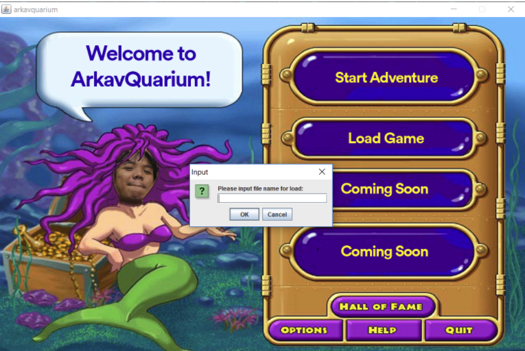
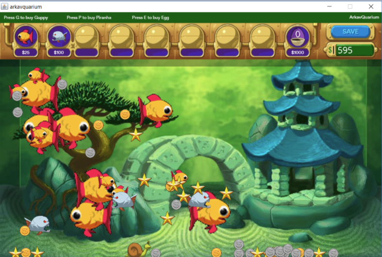
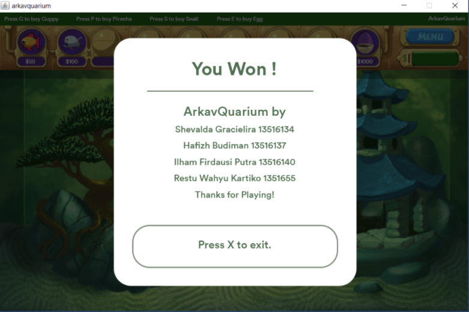

# ArkavQuarium
Insaniquarium clone built with Java & Java Swing. Built for ITB-IF3111 Object Oriented Programming class assignment.  

## Demo

  

  

  

## Documentation
[On google docs](https://docs.google.com/document/d/1QYHY1_zMvTbS6hDZw6aPbJqkEW54yA_VBcatZelwJtg/edit?usp=sharing)

